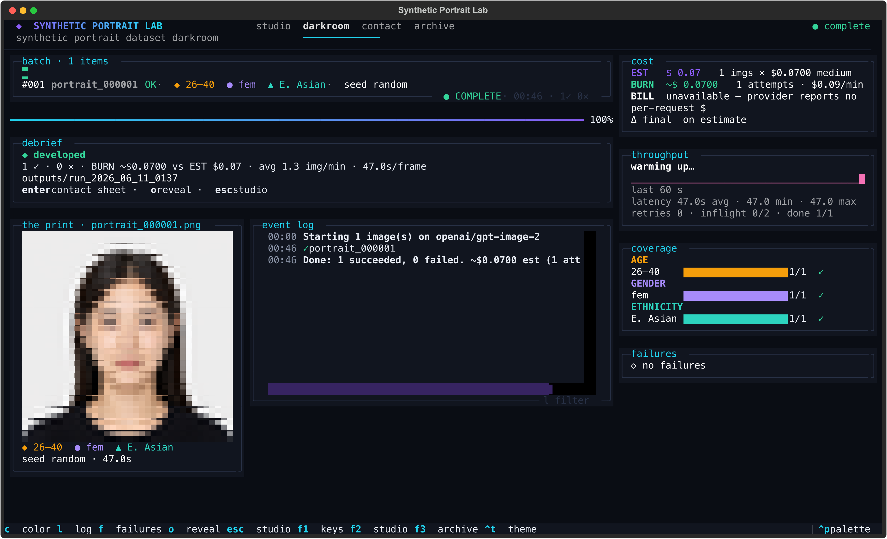

# Synthetic Portrait Lab

A terminal darkroom for generating balanced synthetic portrait datasets.

Generating images is easy. Generating a usable dataset is not. You need to know what was generated, what it cost, which demographic buckets are covered, which jobs failed, and whether the output looks sane — while the batch is still running, not after the budget is gone.

Synthetic Portrait Lab is a terminal-native workbench for exactly that. You pick demographic buckets, a model, a batch size and a variation level; it builds the prompts, estimates the spend, makes you confirm it, then generates the batch while you watch coverage, cost, throughput, failures, and the portraits themselves develop on one screen. Every run is saved with auditable metadata.

It generates synthetic people only — faces of no one who exists.



```
batch:     8 portraits, even across age × gender × ethnicity
lanes:     2 concurrent generations
coverage:  live bars per age / gender / ethnicity bucket
cost:      EST (plan) · BURN (every attempt, retries incl.) · BILL (provider, if reported)
output:    portrait_000001.png … + metadata.jsonl / .csv / manifest.json
```

## What it does

- Runs portrait-generation batches from the terminal, across pluggable providers (`mock`, `openai`, `google`, `fal`, `replicate`).
- Builds the prompts for you. Demographic buckets plus a variation level produce a consistent passport-style portrait prompt; hard constraints (front-facing, full head visible, one person, neutral expression, plain background) are always enforced.
- Shows generated portraits as they land — rendered in the terminal as half-block pixels.
- Estimates cost before you spend, refuses to start until you confirm, and tracks live burn (every attempt, retries included) — never a fake "actual".
- Tracks dataset coverage across age, gender, and ethnicity buckets as the batch fills in.
- Surfaces failures in a triage table instead of burying them in logs — a bad item never crashes the batch.
- Writes every run to disk: `images/` plus `metadata.jsonl`, `metadata.csv`, and a `manifest.json`.

## Why this exists

Most generation scripts hide the parts that actually matter for dataset work:

- what it's costing you, mid-run
- which jobs failed, and why
- whether coverage is skewed toward one bucket
- throughput and latency, so you can tell a slow run from a stuck one
- duplicate or visibly bad outputs
- where the files went

Synthetic Portrait Lab puts those on screen while the batch runs. The point isn't generating one nice picture — it's generating a balanced, accounted-for set and knowing it's balanced before you spend the rest of the budget.

## Quick start

Python 3.10+.

```bash
git clone <repo-url> synthetic-portrait-lab
cd synthetic-portrait-lab

python -m venv .venv && source .venv/bin/activate
pip install -e ".[all]"        # core + TUI + GUI + tests; or ".[tui]" / ".[gui]" / ".[dev]"
```

Generate a free, offline test batch. The `mock` provider needs no key and runs the whole pipeline locally:

```bash
python -m app.cli.generate --provider mock --model mock-image --count 8 --variation 2 --yes
```

Then open the darkroom:

```bash
python -m app.tui.main          # or the installed script: portrait-tui
```

Press `ctrl+g` to expose (confirm) a batch. The mock model is free, so your first run costs nothing.

### Real providers

Copy the example env file and fill in only the providers you'll use:

```bash
cp .env.example .env
```

```bash
OPENAI_API_KEY=
FAL_KEY=
REPLICATE_API_TOKEN=
GEMINI_API_KEY=          # Nano Banana / Nano Banana Pro (GOOGLE_API_KEY also accepted)
```

Keys are read at runtime only. They are never printed, logged, or written into metadata or the manifest.

## Configuration

Everything you'd want to control on a run, and the flag that controls it:

| What | CLI flag | Notes |
|---|---|---|
| Batch size | `--count` | total images |
| Output directory | `--output` | defaults to a timestamped dir under `./outputs` |
| Provider / model | `--provider` / `--model` | defaults from `.env`; see [Providers](#providers) |
| Size | `--size` | canvas resolution; default `1024x1024` (see Resolution and framing) |
| Quality | `--quality {low,medium,high,auto}` | render quality; drives price on token-billed models (default medium) |
| Framing | `--framing {close,standard,loose,upper-body}` | how much of the image height the head fills |
| Head height | `--head-height-pct` | exact head share, 20–90; overrides `--framing` |
| Demographic buckets | `--age` / `--gender` / `--ethnicity` | repeatable, one whole bucket each; omit to use all configured |
| Distribution | `--distribution {even,random,weighted,exact}` | how the count spreads across buckets |
| Per-bucket weight | `--weight TOKEN=VALUE` | repeatable; used by `weighted` |
| Variation | `--variation {0,1,2,3}` | natural variation on top of the fixed constraints |
| Concurrency | `--concurrency` | parallel requests (CLI default 1) |
| Filename prefix | `--prefix` | default `portrait` → `portrait_000001.png` |
| Retries | `--max-retries` / `--no-retry` | default 3 retries with backoff |
| Reproducibility | `--seed` | per-image seed is `base + index`, so the batch repeats exactly |

The TUI exposes the same settings as form controls in the Studio screen and re-plans the cost and distribution on every change. `--list-models` prints the registry; `--dry-run` plans and estimates without generating.

Optional defaults live in `.env`: `PORTRAIT_DEFAULT_PROVIDER`, `PORTRAIT_DEFAULT_MODEL`, `PORTRAIT_OUTPUT_BASE_DIR`, `PORTRAIT_ALLOW_CUSTOM_BUCKETS`, `PORTRAIT_MODEL_REGISTRY_PATH`.

**Buckets** (defaults — override with the flags above, or allow arbitrary ones with `PORTRAIT_ALLOW_CUSTOM_BUCKETS=true`):

- Age — young adult 18–25 · adult 26–40 · middle-aged 41–60 · older adult 61–80
- Gender presentation — male-presenting · female-presenting · androgynous or non-binary-presenting
- Apparent ancestry — East Asian · South Asian · Southeast Asian · Black African descent · Middle Eastern or North African · Latino or Hispanic · White European · mixed heritage

**Variation** adds permitted natural variation on top of the fixed studio constraints — it never relaxes them:

| Level | Behaviour |
|---|---|
| 0 | strict repeatability — standardized setup, minimal variation |
| 1 | very subtle face / hair differences |
| 2 | moderate — face shape, hair, soft lighting, skin texture |
| 3 | high but realistic, incl. slight camera distance — the full head stays visible and centered |

**Resolution and framing** are independent: resolution is the canvas, framing is how large the head sits inside it.

- *Size* (`--size`, default `1024x1024`) picks the canvas. Each model lists its sizes (`--list-models`). `gpt-image-2` ships ten presets from `1024x1024` up to 4K (`3840x2160` / `2160x3840`) and also accepts custom resolutions — both edges multiples of 16, longest edge ≤ 3840, aspect ≤ 3:1, total pixels between 0.66 MP and 8.29 MP. Sizes that fail these rules are rejected before any spend.
- *Framing* (`--framing` / `--head-height-pct`) sets the head's share of the image height, measured top of hair to chin: close headshot 75% · standard headshot 60% · loose headshot 45% · upper body 30%. `--head-height-pct` takes an exact value (20–90) and overrides the preset.

> Framing is a prompt instruction, not a measured crop — the model approximates the head size, it isn't pixel-exact. Detecting the face box and cropping/padding to enforce it precisely is a planned post-processing step.

**Pricing** lives in `app/core/model_registry.json`, not in code. Point `PORTRAIT_MODEL_REGISTRY_PATH` at your own copy to override it. The bundled prices are starting points, not authoritative — verify them against each provider's current pricing. A `null` price means *unknown*: the app warns and requires explicit confirmation before spending.

### Cost accounting

The app keeps three numbers separate — it never collapses them into one "actual":

- **EST** — the pre-run estimate: per-image price (for the chosen model, size and quality) × planned outputs.
- **BURN** — estimated spend from *billable API attempts*. A retry or a failed call is another attempt, so BURN can exceed EST. It's still an estimate.
- **BILL** — real provider-reported spend, shown only when the API actually returns a per-request USD amount. OpenAI's image endpoints don't, so BILL reads *unavailable* and the figure stays an estimate.

Your provider dashboard can legitimately differ from EST because:

- Image models like gpt-image are billed **per token**, scaling with **size and quality** — not a flat per-image price. The registry's per-quality numbers (low/medium/high) are approximations; verify them.
- Providers bill **every attempt**, including **retried and failed** requests.
- Token-billed image generation may appear on the dashboard under **"Responses / Chat Completions"** with token usage rather than under "Images".

When the API returns a usage/token object, it's captured into `manifest.json` (`provider_usage`, plus `api_attempts` / `estimated_cost_from_attempts_usd` / `provider_reported_cost_usd`) so a run's cost can be audited later — even when no USD figure is returned.

## Providers

| Provider | Key | Models |
|---|---|---|
| `mock` | — | free, offline, deterministic PNGs — the default, and what the tests use |
| `openai` | `OPENAI_API_KEY` | `gpt-image-1`, `gpt-image-2` |
| `google` | `GEMINI_API_KEY` | `nano-banana` (Gemini 2.5 Flash Image), `nano-banana-pro` (Gemini 3 Pro Image) |
| `fal` | `FAL_KEY` | `imagen4`, `flux/dev` |
| `replicate` | `REPLICATE_API_TOKEN` | `black-forest-labs/flux-schnell` |

None of the bundled real providers return a billed per-image amount, so their cost is reported as *estimated* (computed from the registry price). Adding a provider is one small subclass of `ImageProvider` in `app/core/providers/`, registered in `registry.py`, plus its models in the registry JSON.

## The TUI

The darkroom build is a multi-screen [Textual](https://textual.textualize.io) app, keyboard-first throughout. Top nav: **studio · darkroom · contact · archive**.

- **Studio** (`f2`) — compose the batch. Model picker with prices and key status (`ctrl+n`), size / count / variation / distribution / seed / concurrency, colour-coded demographic buckets, per-bucket weights in weighted mode, and a live readout that re-plans the exact cost and distribution on every change. `ctrl+e` pages through the actual planned prompts.
- **Expose** (`ctrl+g`) — the one irreversible step: a confirm-spend modal. Priced runs arm on `enter` and confirm on a second `enter`; free runs confirm in one press; un-priced models show `-.--` (never a fake `0.00`) and require typing `spend`. Generation only ever starts after this.
- **Darkroom** — the live run, in panels: **batch** (a glyph-per-frame matrix you can recolour by state / age / gender / ethnicity as a live bias check), **lanes** (concurrency), **throughput** (sparkline with a stall-aware ETA), **cost** (EST / BURN / BILL ledger — see Cost accounting), **coverage** (per-bucket bars), **failures** (triage table), **event log**, and **the print** — the newest portrait rendered live in half-block pixels.
- **Contact sheet** — every frame of a finished run as a thumbnail grid, with a near-fullscreen lightbox (`enter`) and the exact prompt per image (`v`).
- **Archive** (`f3`) — every past run reconstructed from `manifest.json` / `metadata.jsonl` on disk; sortable, filterable, with lifetime totals. An unreadable manifest degrades to a dimmed row, never a crash.

During a run: `c` recolour · `l` filter log · `f` failures · `o` reveal output · `enter` contact sheet · `esc` back to the studio (the run keeps going) · `ctrl+x` twice cancels (in-flight frames finish, queued frames skip, everything on disk is kept). Global: `f1` lists every key · `ctrl+t` cycles four themes (darkroom / gallery / synthwave / safelight) · `ctrl+p` opens the command palette. Compose settings persist between sessions in `~/.portrait_studio_tui.json` (never secrets); set `PORTRAIT_TUI_ASCII=1` for plain-ASCII glyphs.

### Also: CLI and GUI

The TUI, CLI and GUI are three front-ends over one engine — same request object, same planner, same providers.

- **CLI** (`python -m app.cli.generate`) — headless and scriptable; prints the confirmation block and prompts before spending (skip with `--yes`). Exit codes: `0` success, `1` some items failed, `2` user/validation error.
- **GUI** (`python -m app.gui.main`) — opens as a native desktop window via the OS webview; `--web` runs it as a local browser app instead. Form controls, a reactive cost card, a confirmation dialog, and a preview gallery that fills in as images complete.

## Output

Each run writes a self-contained, timestamped directory:

```
outputs/
  run_2026_06_10_2344/
    images/
      portrait_000001.png
      portrait_000002.png
      …
    metadata.jsonl     # one record per item, streamed as it completes (crash-safe)
    metadata.csv       # same columns across successes and failures
    manifest.json      # run settings + estimate + summary (valid JSON, no secrets)
```

A `metadata.jsonl` record:

```json
{
  "id": "portrait_000001", "filename": "portrait_000001.png",
  "provider": "openai", "model": "gpt-image-2",
  "age_bucket": "young adult, 18 to 25", "gender_bucket": "male-presenting",
  "ethnicity_bucket": "East Asian", "variation_level": 3,
  "size": "1536x1024", "quality": "medium",
  "estimated_cost_usd": 0.07, "actual_cost_usd": null, "cost_is_estimated": true,
  "created_at": "2026-06-10T21:45:02Z", "status": "success",
  "retries": 0, "attempts": 1,
  "prompt": "…"
}
```

Failures are kept, not dropped: `{"id": "portrait_000042", "status": "failed", "error": "Provider timeout", "retries": 3, …}`.

## Example workflow

1. In the Studio, choose your coverage: all four age buckets, both gender presentations, two ethnicities — distribution `even`.
2. Set count to 8, variation to 2, concurrency to 2. The readout shows the exact plan and `$0.56` estimated on `gpt-image-2` (8 × $0.07 medium).
3. Press `ctrl+g` and confirm the spend.
4. Watch the darkroom: lanes fill, the batch matrix lights up frame by frame, coverage bars climb, and each finished portrait develops in **the print**. Press `c` to recolour the matrix by ethnicity and eyeball the balance.
5. On finish, `enter` opens the contact sheet — scan the faces, `v` reads any prompt, `o` reveals the output folder.
6. If anything failed, `f` opens the triage table with the error and retry count.

## Development

```bash
pip install -e ".[dev]"
pytest                 # 144 tests, no network — real provider APIs are never called
```

Run the front-ends straight from source: `python -m app.cli.generate`, `python -m app.tui.main`, `python -m app.gui.main`. The package installs editable, so there's no separate build step.

No linter or type-checker is wired into the project config yet. The suite covers prompt generation, bucket validation, cost estimation, all four distribution modes (plus reproducibility), metadata/manifest writing, the provider/engine abstraction (mock generation, retries, failures-don't-crash, the confirm gate), and the TUI telemetry reducer and pilot flows.

## Roadmap

Not built yet — direction, not promises:

- face-detection crop normalization, to enforce the framing head height exactly
- richer metadata export and dataset manifests
- prompt / template version tracking per run
- duplicate / near-duplicate detection
- a quality-review queue driven from the contact sheet
- resumable batches
- size and framing controls in the web GUI (today they're in the CLI and TUI)

## Safety

This is a portrait dataset tool, not a fake-ID generator. It produces synthetic people only — no real-person or celebrity references, and no identity documents. Prompts stay oriented to neutral studio portraits. Keep your usage aligned with that intent.

## License

MIT, declared in `pyproject.toml`. A standalone `LICENSE` file hasn't been committed yet — add one before distributing.
